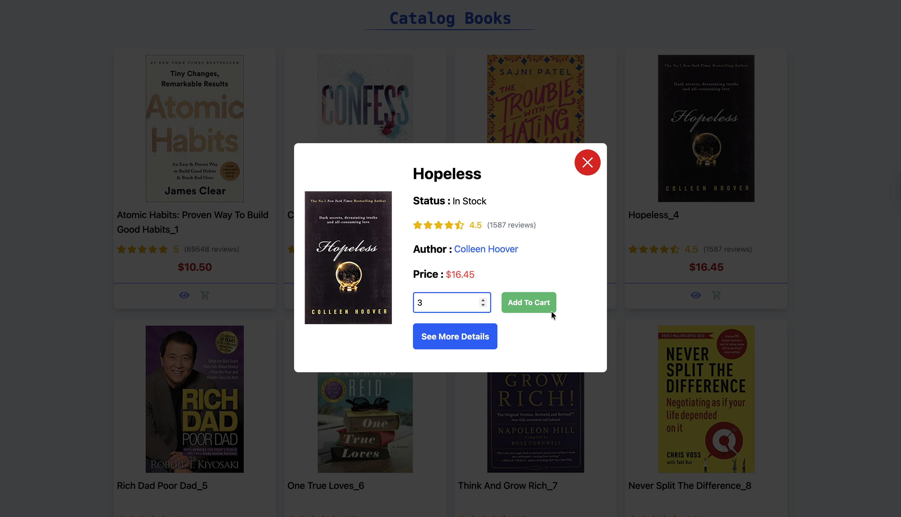
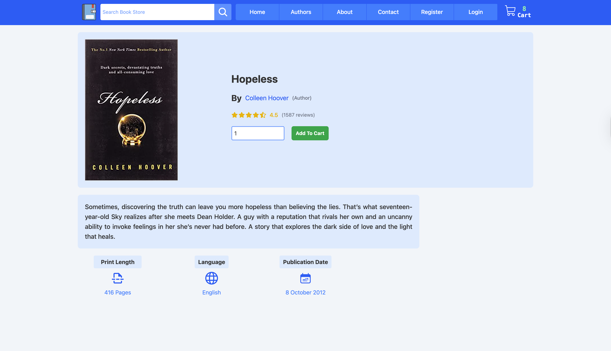
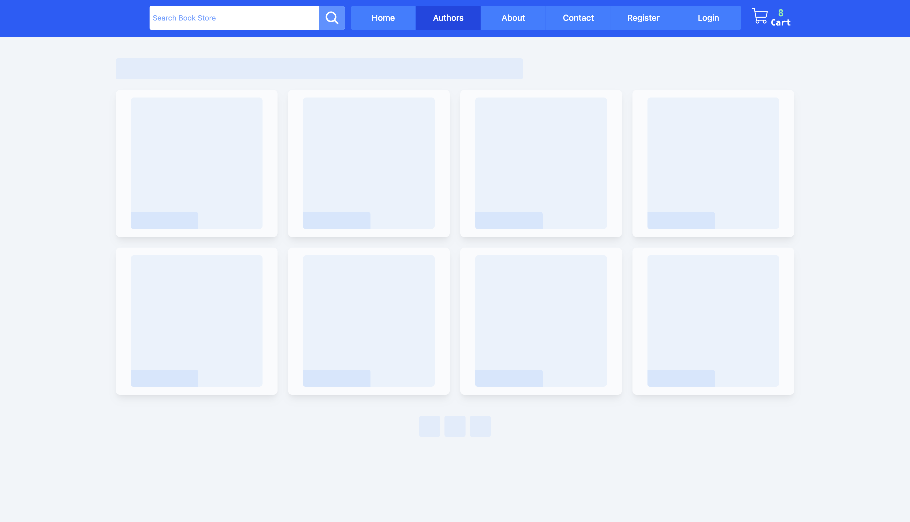
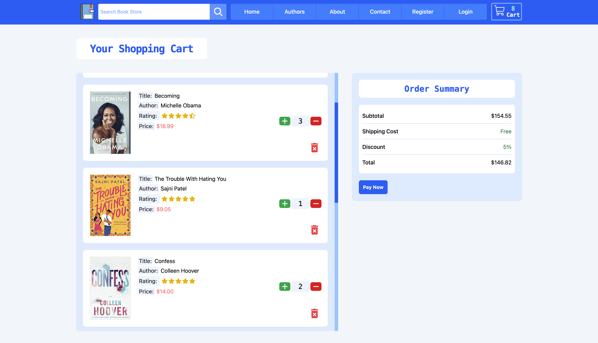
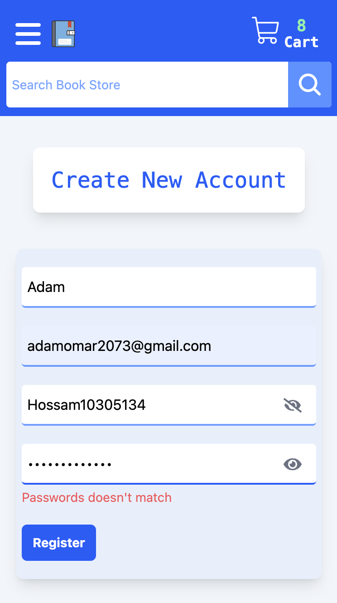

# 📚 Bookstore — Modern React Book Shop

<div align="center">


<br />

[**🌐 Live Demo**](https://book-store-fawn-ten.vercel.app)

</div>

---

## 🌟 Overview

An advanced e-commerce frontend engineered with **React 19** and **TypeScript**. This project demonstrates mastery of complex state management using **Context API** and **useReducer**, delivering a high-performance shopping experience with persistent data synchronization and a refined UI featuring custom skeleton loading strategies.

---

## 📊 Lighthouse Audit

This project is engineered to meet the absolute highest standards of modern web performance, accessibility, best practices, and search engine optimization, achieving a near-perfect mobile audit score:

<div align="center">
  
</div>

## 📸 Visual Journey

### 🖥️ Desktop Experience

|           Premium Storefront & Sliders            |              Real-time Author Discovery              |
| :-----------------------------------------------: | :--------------------------------------------------: |
|  |  |

|                 Quick View Popup Logic                  |                   In-depth Book Details                   |
| :-----------------------------------------------------: | :-------------------------------------------------------: |
|  |  |

|             Professional Skeleton Loading              |             Advanced Cart Management              |
| :----------------------------------------------------: | :-----------------------------------------------: |
|  |  |

### 📱 Mobile-First Excellence

|                    Home View                     |                   Navigation                    |                    Secure Access                     |                     Search UI                      |
| :----------------------------------------------: | :---------------------------------------------: | :--------------------------------------------------: | :------------------------------------------------: |
|  |  |  |  |

---

## ✨ Key Features

- **🔍 Real-time Search Engine:** High-performance dynamic filtering for authors and books with instant UI feedback.
- **🛒 Advanced Cart Logic:** Full-featured shopping cart built with `useReducer` and persistent **LocalStorage** synchronization.
- **⚡ Performance Engineered:** Optimized initial load times utilizing **React Lazy Loading**, **Suspense**, and **Memoization**.
- **🏗️ Modular Architecture:** Highly organized code structure designed for enterprise-level scalability and maintenance.
- **♿ UX Focused:** Seamless navigation with zero layout shifts and accessible interactive elements.

---

## 🛠️ Technical Highlights

### 🏗️ Advanced State Architecture

- **Centralized Logic:** Implemented **Context API** combined with **useReducer** to handle complex cart operations, ensuring a predictable data flow without external libraries.
- **Data Persistence:** Developed a robust synchronization layer to maintain user sessions and shopping states across browser reloads.
- **Type Safety:** Utilized **TypeScript** to define precise data structures for books, authors, and application state, eliminating runtime errors.

### ⚡ Performance & UX Engineering

- **Skeleton Screens:** Engineered custom **Skeleton Pulse Loaders** for all lazy-loaded routes to provide a premium, shift-free loading experience.
- **Rendering Optimization:** Applied **Memoization** (`useMemo`, `useCallback`) to heavy search and filter computations to ensure smooth UI transitions.
- **Adaptive Layouts:** Built an intelligent **Product Slider** and dynamic pagination system that automatically adapts to various screen resolutions.

### 🔐 Form & Input Validation

- **Schema Validation:** Integrated **Zod** with **React Hook Form** to enforce strict data integrity across authentication and contact modules.
- **Atomic Components:** Created a library of highly reusable form atoms ensuring consistent design patterns project-wide.

---

## 📂 Project Structure

```text
src/
├── components/
│   ├── ui/          # Reusable Atoms (Buttons, Inputs, Skeletons)
│   └── sections/    # Modular UI blocks (Hero, Catalog, Feature blocks)
├── context/         # Global State Management (Cart & UI Contexts)
├── pages/           # Domain-specific views (Home, Auth, Cart, Authors)
├── routes/          # Centralized React Router configuration
├── types/           # Global TypeScript definitions
├── utils/           # Shared utility functions (Formatting, UI helpers)
└── data/            # Centralized local data repository
```

---

## 🛠️ Installation & Local Setup

### 1. Clone the repository

```bash
git clone https://github.com/HossamGezo/book_store.git
cd book_store
```

### 2. Install dependencies

```bash
npm install
```

### 3. Run Development

```bash
npm run dev
```

---

## 👨‍💻 Connect with Me

- **LinkedIn:** [Hossam Gouda](https://www.linkedin.com/in/hossam-gouda-software-engineer)
- **GitHub:** [Hossam Gouda](https://github.com/HossamGezo)
- **Email:** hossamgouda27@gmail.com

---

Developed with precision by **Hossam Gouda**  
**Front-End Engineer focused on building scalable and maintainable user interfaces.**
